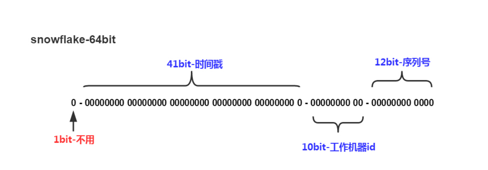

#### 背景

主键（Primary Key），用于**唯一**标识表中的每一条数据。所以，一个合格的主键的最基本要求应该是唯一性。

那怎么保证唯一呢？相信绝大部分开发者在刚入行的时候选择的都是数据库的自增id，因为这是一种非常简单的方式，数据库里配置下就行了。但自增主键优缺点都很明显。

优点如下：
1. 无需编码，数据库自动生成，速度快，按序存放。
2. 数字格式，占用空间小。


缺点如下：
1. 有数量限制。存在用完的风险。
2. 导入旧数据时，可能会存在id重复，或id被重置的问题。
3. 分库分表场景处理过于麻烦。

GUID

GUID，全局唯一标识符，是一种有算法生成的二进制长度为128位的数字标识符，在理想情况下，任何计算机和计算机集群都不会生成两个相同的GUID，所以可以保证唯一性。但也是有优缺点的。分别如下：

优点如下：
1. 分布式场景唯一。
2. 跨合并服务器数据合并方便。


缺点如下：

1. 存储空间占用较大。
2. 无序，涉及到排序的场景下性能较差。

GUID最大的缺点是无序，因为数据库主键默认是聚集索引，无序的数据将导致涉及到排序场景时性能降低。虽然可以根据算法生成有序的GUID，但对应的存储空间占用还是比较大的。


#### 概念介绍

所以，本文的重点来了。如果能优化自增和GUID的缺点，是不是就算是一个更好的选择呢。一个好的主键需要具备如下特性：

1. 唯一性。
2. 递增有序性。
3. 存储空间占用尽量小。
4. 分布式支持。

经过优化后的雪花算法可以完美支持以上特性。


下图是雪花算法的构成图：



雪花id组成由1位符号位+41位时间戳+10位工作机器id+12位自增序号组成，总共64比特组成的long类型。

 __1位符号位__ ：因为long的最高位是符号位，正数为0，负数为1，咱们要求生成的id都是正数，所以符号位值设置0。

 __41位时间戳__ ：41位能表示的最大的时间戳为2199023255552（1L<<41），则可使用的时间为2199023255552/(1000*60*60*24*365)≈69年。到这里可能会有人百思不得姐，时间戳2199023255552对应的时间应该是2039-09-07 23:47:35，距离现在只有不到20年的时间，为什么笔者算出来的是69年呢？

其实时间戳的算法是1970年1月1日到指点时间所经过的毫秒或秒数，那咱们把开始时间从2020年开始，就可以延长41位时间戳能表达的最大时间。

 __10位工作机器id__ ：这个表示的是分布式场景中，集群中的每个机器对应的id，所以咱们需要给每个机器编号。10位的二进制最大支持1024个机器节点。

 __12位序列号__ ：自增值，毫秒级最大支持4096个id，也就是每秒最大可生成**4096000**个id。说个题外话，如果用雪花id当成订单号，淘宝的双十一的每秒的订单量有这个多吗？

到这里，雪花id算法的结构已经介绍完了，那怎么根据这个算法封装成可以使用的组件呢？ 


#### 开发方案

作为一个程序员，根据算法逻辑写代码这属于基础操作，但写之前，还需要把算法里可能存在的坑想清楚，咱们再来一起来过一遍雪花id的结构。

首先，41位的时间戳部分没有特别需要注意的，起始时间你用1970也是可以的，反正也够用十几二十年（二十年之后的事，关我屁事）。或者，你觉得你的系统可以会运行半个世纪以上，那就把当前离你最近的时间作为起始时间吧。

其次，10位的工作机器id，你可以每个机器编个号，0-1023随便选，但人工搞这件事好像有点傻，如果就两三台机器，人工配下也无所谓。可是，docker或者k8s环境下，怎么配呢？所以，咱们需要一个自动分配机器id的功能，在程序启动的时候，分配一个未使用的0-1023的值给当前节点。同时，可能会存在某个节点重启的情况，或者频繁发版的情况，这样每次都生成一个新的未使用的id会很快用完这1024个编号。所以，咱们还需要实现机器id自动回收的功能。

总结一下，自动分配机器id的算法需限制生成的最大数量，既然有最大数量限制，由于节点重启导致的重新分配，可能会很快用完所有的编号，那么，咱们算法就必须支持编号回收的功能。实现这个功能的方式有很多种，但都需要借助数据库或者中间件，java平台的可能用zookeeper比较多，也有用数据库来实现的（百度和美团的的分布式id算法就是基于雪花算法，借助数据库实现的），由于笔者是基于.net平台平台开发，这里就借助redis来实现这个方案。

首先，程序启动时，调用redis的incr命令，获取一个自增的key的值，判断key值是否小于或等于雪花id允许的最大机器id编号，如果满足条件，说明当前编号暂未使用，则此key的值即为当前节点的workid，同时，
借助redis的有序集合命令，将key值添加进有序集合中，并将当前时间的对应的时间戳作为score。然后借助后台服务，每隔指定的时间刷新key的score。

之所以需要定时刷新score，是因为我们可以根据score来判断指定的key对应的机器节点是否还存在。比如，程序设置的5分钟刷新下score，则key的score对应的时间戳如果是5分钟之前的，则表示这个key对应的节点掉线了。则这个key就可以被再次分配给其他的节点了。

所以，当调用redis的incr命令返回的值大于1024，则表示0-1023之间的所有编号都已经被用完了，则我们可以调用redisu获取指定score区间的命令来获取score大于五分钟的id，得到的id则是可以被再次使用的。这样就完美解决了机器id回收复用的问题。

最后，也是一个不容忽视的坑，时钟回拨。在正式解释这个概念的时候，咱们先来看一个故事，准确的说，应该算事故。


> 1991 年 2 月第一次海湾战争期间，部署在沙特宰赫兰的美国爱国者导弹系统未能成功追踪和拦截来袭的伊拉克飞毛腿导弹。结果飞毛腿导弹击中美国军营。


> 损失：28 名士兵死亡，100 多人受伤


> 故障原因：时间计算不精确以及计算机算术错误导致了系统故障。从技术角度来讲，这是一个小的截断误差。当时，负责防卫该基地的爱国者反导弹系统已经连续工作了100个小时，每工作一个小时，系统内的时钟会有一个微小的毫秒级延迟，这就是这个失效悲剧的根源。爱国者反导弹系统的时钟寄存器设计为24位，因而时间的精度也只限于24位的精度。在长时间的工作后，这个微小的精度误差被渐渐放大。在工作了100小时后，系统时间的延迟是三分之一秒。

> 0.33 秒对常人来说微不足道。但是对一个需要跟踪并摧毁一枚空中飞弹的雷达系统来说，这是灾难性的。飞毛腿导弹空速达4.2马赫（每秒1.5公里），这个”微不足道的”0.33秒相当于大约 600 米的误差。在宰赫兰导弹事件中，雷达在空中发现了导弹，但由于时钟误差没能精确跟踪，反导导弹因而没有发射拦截。

因为毫秒级的时间延迟，导致这么大的损失。试想一下，如果咱们写的代码，导致了公司财物上的损失，会不会被抓去祭天呢？所以，时钟回拨的问题，咱们需要重视。那说了这么一大段废话，什么是时钟回拨呢？

简单讲，计算机内部的计时器在长时间运行时，不能保证100%的精确，存在过快或者过慢的问题，所以，就需要一个时间同步的机制，在时间同步的过程中，可能将当前计算机的时间，往回调整，这就是时钟回拨（个人理解，如有错误，可移步评论区），参考文献：https://zhuanlan.zhihu.com/p/150340199。

那么机器回拨的问题改怎么解决呢？君且耐心往下看。

本人在编写实现雪花算法的代码前，翻阅了挺多实现雪花算法的开源代码，有一大部分给出的解决方案是等。比如说，获取到的时间戳小于上一时间对应的时间戳，则写个死循环进行判断，直到当前获取的时间戳大于上一个时间对应的时间戳。通常来讲，这样的作法没问题，因为理论上由于机器原因导致的时间回拨不会差的太多，基本上都是毫秒级的，对于程序来讲，并不会有太大影响。但是，这依然不是一个健壮的解决方案。

为什么这样说呢？不知道大家有没有听过冬令时和夏令时。相信绝大部分人不太了解这个，因为咱们天朝用的都是北京时间。但如果你在国外生活或者工作过，可能就会了解冬令时或夏令时，具体的概念我就不会说了，有兴趣的请自行百度。这里我只阐述一个现象，就是使用夏令时的国家会存在时钟回拨一个小时的情况。如果你在生成id的时候，写的是死循环来解决回拨的话，那么，我真的无法想象你会不会被祭天，反正我会。

个人觉得要从根本上解决这个问题，最好的办法还是切换一个新的workid。但如果直接按照我上面所描述的直接获取5分钟以前回收的workid则还是会出现问题，可能会存在在时钟回拨之前，这个workid刚刚离线，那么此时如果将这个workid重新分配给一个时钟回拨1小时的节点，则非常有可能出现重复的id。所以，咱们在从有序列表中获取已经被回收的workid时，可顺序获取，即获取离线时间最久的workid。

编码思路也说完了，那怎么一起来看看具体的代码实现。

SnowflakeIdMaker类是实现此方案的主要代码，具体如下所示：


``` 
public class SnowflakeIdMaker : ISnowflakeIdMaker
{
    private readonly SnowflakeOption _option;
    static object locker = new object();
    //最后的时间戳
    private long lastTimestamp = -1L;
    //最后的序号
    private uint lastIndex = 0;
    /// <summary>
    /// 工作机器长度，最大支持1024个节点，可根据实际情况调整，比如调整为9，则最大支持512个节点，可把多出来的一位分配至序号，提高单位毫秒内支持的最大序号
    /// </summary>
    private readonly int _workIdLength;
    /// <summary>
    /// 支持的最大工作节点
    /// </summary>
    private readonly int _maxWorkId;

    /// <summary>
    /// 序号长度，最大支持4096个序号
    /// </summary>
    private readonly int _indexLength;
    /// <summary>
    /// 支持的最大序号
    /// </summary>
    private readonly int _maxIndex;

    /// <summary>
    /// 当前工作节点
    /// </summary>
    private int? _workId;

    private readonly IServiceProvider _provider;


    public SnowflakeIdMaker(IOptions<SnowflakeOption> options, IServiceProvider provider)
    {
        _provider = provider;
        _option = options.Value;
        _workIdLength = _option.WorkIdLength;
        _maxWorkId = 1 << _workIdLength;
        //工作机器id和序列号的总长度是22位，为了使组件更灵活，根据机器id的长度计算序列号的长度。
        _indexLength = 22 - _workIdLength;
        _maxIndex = 1 << _indexLength;

    }

    private async Task Init()
    {
        var distributed = _provider.GetService<IDistributedSupport>();
        if (distributed != null)
        {
            _workId = await distributed.GetNextWorkId();
        }
        else
        {
            _workId = _option.WorkId;
        }
    }

    public long NextId(int? workId = null)
    {
        if (workId != null)
        {
            _workId = workId.Value;
        }
        if (_workId > _maxWorkId)
        {
            throw new ArgumentException($"机器码取值范围为0-{_maxWorkId}");
        }

        lock (locker)
        {
            if (_workId == null)
            {
                Init().Wait();
            }
            var currentTimeStamp = TimeStamp();
            if (lastIndex >= _maxIndex)
            {
                //如果当前序列号大于允许的最大序号，则表示，当前单位毫秒内，序号已用完，则获取时间戳。
                currentTimeStamp = TimeStamp(lastTimestamp);
            }
            if (currentTimeStamp > lastTimestamp)
            {
                lastIndex = 0;
                lastTimestamp = currentTimeStamp;
            }
            else if (currentTimeStamp < lastTimestamp)
            {
                //throw new Exception("时间戳生成出现错误");
                //发生时钟回拨，切换workId，可解决。
                Init().Wait();
                return NextId();
            }
            var time = currentTimeStamp << (_indexLength + _workIdLength);
            var work = _workId.Value << _workIdLength;
            var id = time | work | lastIndex;
            lastIndex++;
            return id;
        }
    }
    private long TimeStamp(long lastTimestamp = 0L)
    {
        var current = (DateTime.Now.Ticks - _option.StartTimeStamp.Ticks) / 10000;
        if (lastTimestamp == current)
        {
            return TimeStamp(lastTimestamp);
        }
        return current;
    }
}
``` 
以上代码中重要逻辑都有注释，在此不具体讲解。只说下几个比较重要的地方。

首先，在构造函数中，从IOptions中获取配置信息，然后根据配置中的WorkIdLength的值，来计算序列号的长度。可能会有人不明白这样设计的原因，所以需要这里我稍微展开下。笔者在开发第一版的时候，工作机器的长度和序列号的长度是完全根据雪花算法规定的，也就是工作机器id的长度是10，序列号的长度是12，这样设计会存在一个问题。在上文中我已经提到，10位的机器id最大支持1024个节点，12位的序列号最大支持每毫秒生成4096个id。但如果将机器id的长度改为9，序列号的长度改为13，那么机器最大支持512个节点，理论上也够用。13位的序列号则理论上每毫秒能生成8192。所以通过这样的设计，可以大大提高单节点生成id的效率和性能，以及单位时间内生成的数量。

另外，在Init方法中，尝试着获取IDistributedSupport接口的实例，这个接口有两个方法。代码如下：

``` 
public interface IDistributedSupport
{
    /// <summary>
    /// 获取下一个可用的机器id
    /// </summary>
    /// <returns></returns>
    Task<int> GetNextWorkId();
    /// <summary>
    /// 刷新机器id的存活状态
    /// </summary>
    /// <returns></returns>
    Task RefreshAlive();
}
``` 


这样设计的目的也是为了让有兴趣的读者可以更方便的根据自己的实际情况进行扩展。上文提到了，我是依赖与redis来实现机器id的动态分配的， 也许会有部分人希望用数据库的方法，那么你只需要实现IDistributedSupport接口的方法就行了。下面是此接口的实现类的代码：

``` 
public class DistributedSupportWithRedis : IDistributedSupport
{
    private IRedisClient _redisClient;
    /// <summary>
    /// 当前生成的work节点
    /// </summary>
    private readonly string _currentWorkIndex;
    /// <summary>
    /// 使用过的work节点
    /// </summary>
    private readonly string _inUse;

    private readonly RedisOption _redisOption;

    private int _workId;
    public DistributedSupportWithRedis(IRedisClient redisClient, IOptions<RedisOption> redisOption)
    {
        _redisClient = redisClient;
        _redisOption = redisOption.Value;
        _currentWorkIndex = "current.work.index";
        _inUse = "in.use";
    }

    public async Task<int> GetNextWorkId()
    {
        _workId = (int)(await _redisClient.IncrementAsync(_currentWorkIndex)) - 1;
        if (_workId > 1 << _redisOption.WorkIdLength)
        {
            //表示所有节点已全部被使用过，则从历史列表中，获取当前已回收的节点id
            var newWorkdId = await _redisClient.SortedRangeByScoreWithScoresAsync(_inUse, 0,
                GetTimestamp(DateTime.Now.AddMinutes(5)), 0, 1, Order.Ascending);
            if (!newWorkdId.Any())
            {
                throw new Exception("没有可用的节点");
            }
            _workId = int.Parse(newWorkdId.First().Key);
        }
        //将正在使用的workId写入到有序列表中
        await _redisClient.SortedAddAsync(_inUse, _workId.ToString(), GetTimestamp());
        return _workId;
    }
    private long GetTimestamp(DateTime? time = null)
    {
        if (time == null)
        {
            time = DateTime.Now;
        }
        var dt1970 = new DateTime(1970, 1, 1);
        return (time.Value.Ticks - dt1970.Ticks) / 10000;
    }
    public async Task RefreshAlive()
    {
        await _redisClient.SortedAddAsync(_inUse, _workId.ToString(), GetTimestamp());
    }
}
``` 

以上即是本人实现雪花id算法的核心代码，调用也很简单，首先在Startup加入如下代码：


``` 
services.AddSnowflakeWithRedis(opt =>
{
     opt.InstanceName = "aaa:";
     opt.ConnectionString = "10.0.0.146";
     opt.WorkIdLength = 9;
     opt.RefreshAliveInterval = TimeSpan.FromHours(1);
});
``` 

在需要调用的时候，只需要获取ISnowflakeIdMaker实例，然后调用NextId方法即可。

``` 
idMaker.NextId()
``` 


#### 结尾
至此，雪花id的构成，以及编码过程中可能遇到的坑已分享完毕。
如果您觉得文章或者代码对您有所帮助，欢迎点击文章的【推荐】，或者，git给个小星星也是可以的。

git地址：https://github.com/fuluteam/ICH.Snowflake
